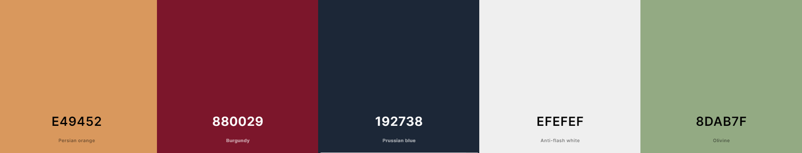

# Bird Count


[View the live site here.](https://birdcount-cff31e785337.herokuapp.com/)

Introducing 'Bird Count', a web app designed to enhance users' bird-watching experience by allowing them to record their observations, keep up to date with community sightings, share their favourite photographs, and keep an eye on their bird-watching stats! This is a great way to keep track of the bird species users have seen, when and where!

Bird count collects data about species' populations, distributions and behaviours. This information is important for ornithologists who have ambitions to improve species health through conservation practices. The [BTO](https://www.bto.org/) is an excellent example of an organisation who work to make a difference for bird welfare and would benefit from this data. 

This projects is partly nspired by the [Big Garden Birdwatch](https://www.rspb.org.uk/whats-happening/big-garden-birdwatch), which takes place the weekend preceding the submission deadline for this project (26th-28th January 2024). This project is also targeting a small gap in bird recording platforms. While researching the topic, I found that there are similar sites for American bird watching but none that contain British bird species and districts in the UK. These are things I have included in the project in order to make this app appealing to British bird watchers. 


## UX

### Flow

The user is initially presented with the welcome page which shows how 'Bird Count' can be used and encourages the user to sign up. There are 'sign-up' buttons located conveniently so the user can easily navigate to the 'sign-up' page at this point. The sign-up button is designed to change depending on whether the user is logged in. If logged in, it will be displayed as an 'add observation' button.

The 'About' page is easily accessed in the header and instinctively is the next stop for users who haven't decided whether to sign up or not. This page explains the benefits of signing up to the user and also for conservation and research. Again, this page is designed to provide the user with an opportunity to understand Bird Count before signing up. A sign-up button as described above is also located on this page for convenience.

Next along in the navigation is 'Community Observations' which is available for anybody to see and use; again so the user feels they understand what they are signing up for before signing up and to encourage them to do so.  This page displays all observations that visible users have added. This list can provide insight into distributions and inspire bird watchers to look in different locations to their 'usual spots'. Again, this page contains a sign-up button. Logged-in users can edit, add and delete observations here.  

If not logged in, the user only has access to the login and register page, other than those mentioned above. The login page has a link to the register page for convenience, and vice versa. 

If logged in, the user has access to their 'nest' as well. This contains personal information including their observations, bird stats and account settings. On log-in or registration, the user is directed here to help them discover it. 

This explains the user journey through the app but there are many more features than mentioned. One of which, which is very important for UX is the appearance of flash messages whenever the user does something significant. For example, if they log in, delete, edit or add an observation a flash message will appear explaining what has happened. This is important for the user to know if the changes that they have made have been successful or not.

### Colour Scheme

Some of the most spectacular times of day for bird watchers are early mornings and evenings when light is low; this is when we often hear the dawn chorus and see startling murmurations. My colour scheme reflects these times of day and also provides some eye comfort as I suspect many users will upload their observations in the evenings after a day of spotting birds!

This colour scheme includes dark blues and reddish-orange colours which we often see at dawn/dusk. I have tried to keep good contrast between colours to make this site more accessible for users with visual impairments. I tried to set a background image that contained the orange and navy-blue colours specified below. This helped tie my colour pallet together.

- `#efefef` is used for all text, except for the header and footer, as it provides good contrast with background colours.
- `#192738` is the main background colour; It is also used for the header and footer text where it is suitable for achieving greater contrast.
-  `#243449` is used as the secondary background colour which helps provide contrast between sections.
- `#e49452` is used as a background colour to highlight sections such as the header and footer, and stats.
- `#8DAB7F` is used for 'safe' or 'positive' buttons to encourage the user to press or show that there isn't any danger with pressing the button.
- `#880029` is used for 'danger' buttons. For example, delete buttons use this colour. It's a slightly dull and dark red to provide eye comfort and complement the rest of the colour pallet. 

I used [coolors.co](https://coolors.co/e49452-880029-192738-efefef-8dab7f) to preview my colour palette.



### Typography

- [Laila](https://fonts.google.com/specimen/Laila?query=Laila) is used for the logo, h1, h2, h3, h4 elements. I chose this as I thought the finish/tails on some letters look like feathers.

- [Mallanna](https://fonts.google.com/?query=Mallanna ) is used for secondary text. Most paragraphs, h5 and h6 elements use this font. I chose it for its clarity and similar letter structure to Laila. 

- [Font Awesome](https://fontawesome.com) icons were used throughout the site. These are useful for making buttons, input fields and links clear for the user.

## User Stories

### First Time Users

- As a first time user, I would like to be able to easily navigate the site, so that I can find what I'm looking for intuitively.
- As a first time user, I would like to understand the purpose, benefits and functionality of the site, so I can decide if it fits my needs. 
- As a first time user, I would like to see buttons and links to log-in/register, so that I can sign up easily.
- As a first time user, I would like to see what current users have been doing on the site, so I can see how the site can be used.
- As a first time user, I would like to see links and buttons to add observations with clear instruction, so that I can record my bird sightings.
- As a first time user, I would like a responsive design, so that I can view and add observations on any device.

### Returning Site Users

- As a returning user, I would like to see the observations that I have previously added, so that I can easily keep track of what I have seen, when and where.
- As a returning user, I would like to easily add, edit or delete observations, so that I can make sure my records are accurate.
- As a returning user, I would like to be able to see some stats from my observations, so that I can set some personal bird-watching goals.
- As a returning user, I would like to easily log in, so that I can access my records and data.
- As a returning user, I would like to search through the community observations, so I can find data that is relevant.
- As a returning user, I would like to contact the admin, so I can report any issues with the site or ask questions. 
- As a returning user, I would like an option to hide my observations from the community, so that I can keep my observations to myself if my certainty is low.
- As a returning user, I would like an option to hide my username from the community, so that I can add observations without being identified.
- As a returning user, I would like to be able to see my observations separately, so I don't have to look through lots of data.

### Admin

- As the site admin, I would like to see a list of registered users, so I have information about how the site is used.
- As the site admin, I would like to be able to remove users, so that I can manage site activity and behaviour.
- As the site admin, I would like to delete and edit observations, so that I can improve the experience of site users.
- As the site admin, I would like to be able to see and write messages, so that  I can reply to queries from users.
## Wireframes

To follow best practices and guide myself through the design process, wireframes were developed for mobile, tablet, and desktop sizes.
I've used [Figma](https://www.figma.com/) to design the wireframes.

### Mobile Wireframes

<details>
<summary>Desktop Wireframes</summary>

- Home

  

- Login

  

- Community Observations

  

- My Nest

  

- Create Observation

  

</details>

### Tablet Wireframes

<details>
<summary>Tablet Wireframes</summary>

- Home

  

- Login

  

- Community Observations

  

- My Nest

  

- Create Observation

  

</details>

### Desktop Wireframes

<details>
<summary>Mobile Wireframes</summary>

- Home

  

- Login

  

- Community Observations

  

- My Nest

  

- Create Observation

  

</details>


## Features

### Existing Features

- ##### Navbar
	
	- Simple and intuitive
	     The navbar is simply designed for intuitive use. It offers links to pages that are accessible to the user depending on whether they are logged in. Pages which are not accessible to them will not be displayed in the navbar. The navigation allows first time users to easily navigate and understand the site, and returning users easy access to the page they are looking for.
	- Logo with link to 'welcome' page.
		[Logo with link to welcome page]
    - Responsive navigation
	    - On desktops the 'About' and 'Community Observations' links are visible at all times. There is an additional dropdown section of the navbar which relates to the current user. 
		    - If the user is not logged in, they will see links to 'Sign Up' or 'Log In'. 
		    - If the user is logged in, they will see links to 'My Nest' and 'Logout'. 
		    - If the Admin is logged in they will see 'Admin Nest' and 'Logout'.
			    
		- On tablets and phones the navbar menu is condensed into a burger menu which displays all navigation links.

			<details>
			<summary>More Navbar screenshots</summary>

			Desktop

			
			
			

			Tablet

			
			
			
			

			Mobile

			
			

			</details>

	- User Avatar
		An avatar is assigned to a user depending on the experience level they choose for themselves. This is added as a way to personalise the user's experience with the app and encourage them to get out bird watching so they can change their experience level and get a new avatar! The user can see their avatar in the navbar. This is displayed in the dropdown menu and side menu on all screen sizes and is also displayed as an icon for the dropdown menu on large screen sizes. If the user is logged out, they see an icon representing a user.
		
		Admin's Avatar

		


		<details>
		<summary>More Avatars</summary>

		Egg

		

		Hatchling

		

		Fledgling

		

		Juvenile

		

		Adult

		

		Owl

		


		</details>

- ##### Welcome Page
	The welcome page is the first page the user sees so it is designed to be striking with clear information drawing the user in and showing the purpose of the app.

	- Sign-up / Add observation button
		There is a button located for convenience allowing the user to quickly sign up if they aren't logged in, or to add an observation if the user is logged in. The button changes as a way of enhancing UX as the user won't want to see a button with irrelevant information or direction as it will confuse them.

		[Welcome Page With Button](documentation/features/welcome-button.png)

	- Explanation of the app
		There is a section dedicated to explaining to the user what Bird Count is and what they can do with it. This is a way for the user to find out if it is the right tool for them before signing up.

		[Welcome Page Explanation](documentation/features/welcome-sections.png)
		

	<details>
	<summary>Page Screenshots (responsive design)</summary>

	

	

	

	</details>


	
- ##### About Page
	This page adds more information about Bird Count and how the data is important for conservation and research purposes. I made a separate page for this so it gives extra information only to those who are looking for it, so as not to overwhelm a first time user on the welcome page. 


	- The British Trust for Ornithology
		This section explains the conservations and research benefits of submitting and collecting data like this. It gives interested users the chance to learn more about the [BTO](https://www.bto.org/) by providing a useful link.
		[Learn more section]()
	- Benefits to users
		The next section lists the benefits the app has for the user, helping them understand why the app could be useful. This is supplemented with a convenient 'sign up' or 'add observation' button depending on the user's status. 
		[What's in it for me?]()
	- What's that bird?
		This section is designed to make bird watching more accessible to users who are new to bird watching and may have difficulty identifying birds. It provides a useful link to [Bird Spot](https://www.birdspot.co.uk/british-bird-identifier). I found this bird identification tool while researching apps related to bird watching for inspiration.
		[What's that bird?]()
	
	<details>
	<summary>Page Screenshots (responsive design)</summary>

	

	

	

	</details>

- ##### Community Observations Page

	- Observations table
		This displays all observations submitted by all users that haven't set their account to 'invisible'. It displays data that users might initially find useful for identifying observations, such as species, location, date and user. When an observation is selected a modal pops up. providing all relevant data associated with that observation; this includes the photo uploaded with the observation and any notes the user added. 
		[Community Observation Table]()
		[Community observation modal]()
		The table is responsive and hides less important data columns on smaller screens.
		[Small screen community observation table]()
	- Logged in users can edit and delete their observations from this page
		Observations that belong to the current logged in user are displayed with a column for editing and deleting these observations. The edit and delete observations only appear next to the observations that belong to the current user. These are not visible on smaller screen sizes. 
		[Edit and delete observation buttons]()
	- Search observations
		There is a search functionality for the community observation table which allows the user to find data which is most relevant for them. It allows them to search for words in the fields of user, bird species, and location. I felt these were the most likely be used for finding observations.
		[Search functionality]()
	- Sort observations
		Observations are automatically sorted by date, most recent first, but the user also has the ability to sort by any other field. The only field they cannot sort by is the user field as this caused a bug where anonymous users were including in this sorting and it didn't make sense to the user. 
		[Sort functionality]() 
	- Reset sort and search results
		There is a button located for convenience at the top of the community observations table which resets the search and sort results. All results are then displayed again in the default order.
		[Reset button]()
	- Sign-up / Add Observation Button
		Again, for convenience for the user, I added a button to add observations as this is probably something that is on their mind at this point while looking at other observations. This is also the point I think that new users may be most likely to sign up.

		<details>
		<summary>Responsive page</summary>

		

		

		

		</details>


- ##### My Nest
	The user's nest contains all personal information, including their birding stats, their observations, their messages from the admin, and their account settings. There is double protection to prevent anybody who isn't the current user from accessing their next. 
	- This page is fully responsive.
		[Nest desktop]()
		[Nest tablet]()
		[Nest Mobile]()
		[Responsive modals]
	- Stats and life-list
		The first section for the user to see is the 'My Stats' section which provides some stats based on the data they have provided. This gives makes it easy to set target, see progress, and compare with fellow bird watchers if that's something they are interested in. 
		[Stats]
		The life list is a modal that shows every species the user has seen, to save them looking through all of their observations, and says how many they have seen of each. This is a fun feature to help them see what species they have and haven't seen in-case they have a birding bucket list or similar that they want to compare with.
		[Life list]
	- Personal observations table
		This is very similar to the community observation board but only shows the user's observations. The option to edit and delete observations is available here on every screen size. 
		[Observation table]
		- Delete Observation
			A delete observation confirmation modal pops up asking the user to confirm they want to delete. The observation details are displayed in the modal so the user knows they have selected the intended observation. 
			[Delete Observation Confirmation Modal]
		- Edit Observation
			This redirects the user to the 'Edit Observation' page.
	- Messaging admin
		There is a section dedicated to communications with the admin. The user can message the admin or view their messages by looking in their 'pigeon hole' in this section. 
		[Messaging buttons]
		- Pigeon Hole
			The pigeon hole contains messages from the admin in response to queries from the user. Message summaries are displayed initially and on click, they expand to show the message body. There is an option to reply to or delete each message.
			[Pigeon Hole]
			- Reply to message
				When replying to the admin, all fields are prefilled with the exception of the message body.
				[Reply to message]
			- Delete message
				Confirmation of deletion modal pops up.
				[Confirm Delete Message Modal]
	- Account settings
		This allows the user to edit their account details.
		[Account settings desktop]
		[Account settings Tablet]
		[Account settings Mobile]
		- Privacy settings
			Both of these settings are displayed as switches which are set by default to the user's current privacy settings. 
			[Privacy settings desktop]
			[privacy settings tablet]
			[privacy settings mobile]
			- Visibility
				This determines whether the users observations appear on the community observations board. I felt this was an important feature as some users may not want to use the app for the community aspects, but still want to use the tool for their personal bird watching enhancement! 
				[video demonstration]
			- Anonymity 
				The user is able to hide their username from the community but still show their observations. 
				[video demonstration]
		- Edit email address and experience level
			Both of these options appear as forms in modals. If the changes are valid, a flash message appears confirming the changes. 
			[Edit Account Details Section Desktop]
			[Edit Account Details Section Tablet]
			[Edit Account Details Section Mobile]
			[Edit email modal]
			[Edit experience modal]
		- delete account with confirmation
			This is displayed as a red 'danger' button so the user knows only to press this button if certain it's what they want. 
			[Delete account button]
			This doesn't delete the users observations as I thought that keeping the data is important for potential research, so in the confirmation modal, this is explained.
			[Delete account confirmation modal]
			
- ##### Admin Page
	This page is only accessible to the admin and has double protection to ensure this is the case.
	[Admin Page Desktop]
	[Admin Page Tablet]
	[Admin Page Mobile]
	- List of users
		The admin is provided with a list of users. There is a 'delete user' functionality so they have control over the use and activity of the app. a delete user confirmation modal appears on pressing the button.
		[Delete user confirmation]
	- Messaging
		The admin has access to their pigeon hole which shows messages from users. This has the same functionality as the pigeon hole in 'My Nest'.
		[Pigeon hole admin nest.]
		
- ##### Log in Page
	The user is able to log in by entering their username and password. They are informed if their username or password are incorrect, without indicating which one. This prevents password guessing etc. If the log in is successful they are redirected to either 'My Nest' or 'Admin Nest' depending who has logged in. They are also presented with a flash message confirming that they have successfully logged in.
	[Log in page Desktop]
	[Log in page tablet]
	[log in page mobile]
	
- ##### Register Page
	Registration requires filling a number of input fields, some of which are required, this is made clear, and all that have specific requirements are validated. Tooltips indicate the validation criteria. When a user enters a username, the database is checked to see if this username already exists. If it does exist, the user is informed that they already have an account and is redirected to the log in page. 
	[Registration page desktop]
	[Registration page tablet]
	[Registration page mobile]
	
- ##### Add Observation Page
	This page allows the user to add observations with supporting information. Some fields are required and some are optional; this is made clear. I haven't made it compulsory to select from the autocomplete list as I felt this took away some flexibility in how the user could use the app.
	- Responsive design 
		[Add observation desktop]
		[Add observation tablet]
		[Add observation mobile]
	- Autocomplete input fields
		The bird species autocomplete data was compiled from the [British Ornithological Society (BOU)](https://bou.org.uk/), and contains a comprehensive list of bird species that have been seen in Britain. When researching bird watching applications, I found many that were catered to US bird watching, we have different species in the UK which make these apps less useful here. This list provided by the BOU includes British birds specifically, making the data ideal for bird watching in the UK.
		[Autocomplete birds species]
		Location autocomplete data was compiled from the [Office for National Statistics](https://geoportal.statistics.gov.uk/documents/ons::local-authority-districts-counties-and-unitary-authorities-april-2021-map-in-united-kingdom--1/about) and includes all districts in the UK. I decided to sort locations by districts to make it easier for the user to identify where they are.
		[Autocomplete locations]
	- Date picker
		I added a date and time picker to ensure the values are entered in a format that is easy to sort and search in the database. I set the date picker to only allow the submission of observations from the current data and previous. Users shouldn't be able to post observations from the future, as they won't know what they'll see in the future!
		[Date picker]
	- Fields are validated
		If any fields are invalid, or unfilled when required a flash message or tooltip appears explaining the issue. 
	- Cancel button
		The user is given the option to cancel if they no longer want to add an observation. This redirects them to either the community observations board or their nest, depending on their preference. 
		[Cancel buttons]
		
- ##### Edit Observation page
	The user is given the change to edit observations. This allows them to keep their records accurate in-case they see an extra bird of that species or want to upload a photo they look a little after the event. This page has double protection to stop anyone from editing the observation who isn't the admin or user that created the observation.
	- Responsive Design 
		[Edit observation desktop]
		[Edit observation tablet]
		[Edit observation mobile]
	- Prefilled fields
		All fields are prefilled so the user can see what the observation was initially. This helps them identify what needs changing.
		[Prefilled fields]
	- Cancel
		Cancel buttons are located conveniently to allow the user to change their mind about editing an observation. The user will be redirected to the relevant page.
		[Cancel buttons]
		
- ##### 404/500
	There are 404 and 500 error handlers that redirect the user to the 404 page. This is designed in a way that is meant to bring some humour to the user to make up for their confusion about not being on the correct page. This page redirects the user to the home page where they can navigate back to the page they were looking for using the built in navigation. 
	[404 page desktop]
	[404 page tablet]
	[404 page mobile]
	
- ##### Footer
	- Responsive design
		[Footer desktop]
		The button to sign in or add observation is hidden on smaller screens.
		[Footer tablet]
		[Footer mobile]
	- Logo with link to welcome page
		This helps the user navigate back to the welcome page wherever they are in the site without scrolling back to the top. It also reminds them that they are using Bird Count
	- Sign-in / Add observation button
		This is placed for convenience so the user can easily find the button whatever page they are on.
	- Useful links
		The user is provided with links to the [BTO](https://www.bto.org/), [Bird Spot](https://www.birdspot.co.uk/) and the Bird Count [GitHub repository](https://github.com/secarrel/Bird_Count) so that they can find out more about the app.
		
- ##### Flash Messages    
	It's important for the user to know if actions they have taken have been successful. A flash message saves them the trouble of going to check if changes have taken place. 
	Flash messages appear after the following:
	- User logs in
	- User registers
	- User tries to register with username that exists
	- User gets their password or username incorrect
	- User logs out
	- User creates an observation
	- User edits an observation
	- User deletes an observation
	- User doesn't fill a required input field (this is specifically for the experience level field)
	- User deletes message
	- User edits message
	- User deletes account
	- User edits account details
	
- ##### Tooltips
	Tooltips have been added to any elements that may need clarification or explaining to the user. These can be found throughout the site and are important for UX.
	
- ##### Empty lists message
	There are a few lists displayed throughout the site, including:
	- Life List
	- Community Observations
	- My Observations
	- Messages in the Pigeon Hole
	When these lists are empty the containers they were originally displayed in were empty and formatted in a strange way. The user would have no idea what was going on in this situation so I have added a 'list empty' message explaining that there isn't any data to display. In some of the lists, such as the 'Life List', I added an 'add observation' button if the list is empty so the user can very easily start filling their list.
	
- ##### Double Protection
	There is double protection preventing unauthorised access to every page with user-specific data. I have hidden buttons that direct the user to these pages where appropriate and added checks in the python code to ensure the session user has the right level of access. I have also implemented checks using flask so that on every page, only information specific to the user is displayed. 

### Future Features

There are a number of features that I would like to implement for this application. I feel they would all improve UX and make the app more flexible for the user, therefore more practical and appealing.
- ##### Autocomplete list for searching through community observations
	I think the user would have an easier time finding the observation/observations they are looking for if the search input field makes suggestions based on observation data.
- ##### Search and sort functionalities for observations in 'My Nest'
	This would allow users to easily search through their own observations and review their data more easily.
- ##### Rating system for observation images with the most popular displaying in a gallery page
	I think this feature would give the image upload more significance and also encourage the user to take more photos and share their images. This makes the app more fun and inspiring, hopefully enhancing their bird watching experience even more. 
- ##### Check/bucket list 
	I think it would be really nice for the user to be able to create a list of birds they would really like to see. This allows them to set themselves goals and challenges them to get out bird watching more. Ideally this feature could be shared with 'friends' to share the experience and make it more fun.
- ##### Reset password
	This seems like a basic functionality for a registration/login page, and I feel this should be prioritised in future development of the application. It would allow users who have forgotten their passwords to reset them so they don't lose their data.
- ##### Admin can edit account details
	This would be useful if the email a user has entered is incorrect and they have forgotten their password, for example.
- ##### Make friends
	I think this app would stand out as being different from all others on the market if it allowed you to connect with friends and share your observations and stats with them.
- ##### Improved Messaging
	The messaging functionality is currently very basic and only hints at the potential of this feature. I would like to add an icon that shows if you have unread messages to save the user looking in their pigeon hole unnecessarily. I would also like to improve the UX of this feature as I don't think the modal view is very appealing. 
- ##### Add multiple observations at once
	I think this feature would benefit bird watchers who have a lot of data to upload. Having the option to add many bird species with the rest of the data automatically filled to be the same, would save the user lots of time and effort. It may even make the difference in making this app a long term tool, rather than a fleeting one. 
- ##### Certainty displayed in observation table
	I would like to colour code observations based on certainty so the ones that are 10/10 certain, catch the eye as key observations. This seems like a fun and clear way to convey this information to the user.


## Tools & Technologies Used

- [HTML](https://www.w3schools.com/html/) is used created the main structure of the website.
- [CSS](https://developer.mozilla.org/en-US/docs/Web/CSS) is used to style the site.
- [JavaScript](https://developer.mozilla.org/en-US/docs/Web/javascript) is used for interactivity on the site.
- [Python](https://www.python.org) is used as the back-end programming language.
- [Git](https://git-scm.com) used for version control.
- [GitHub](https://github.com) used for online code storage.
- [VSCode](https://code.visualstudio.com/) is the chosen environment for writing the code for the app.
- [Materialize](https://materializecss.com) is used as a front-end CSS framework to assist with styling and pre-built components.
- [Flask](https://flask.palletsprojects.com) is the Python framework used for the site.
- [MongoDB](https://www.mongodb.com) is the non-relational database management I chose to use for storing data.
- [Heroku](https://www.heroku.com) is hosting the deployed back-end site.
- [Figma](https://www.figma.com/) is used to create wireframes for the project.
- [Logo.com](https://logo.com/) is used to create the logo and favicon for this site.
- [Font Awesome](https://fontawesome.com/) provided icons for the site.
- [website planet](https://www.websiteplanet.com/webtools/responsive-checker/) to check responsiveness of the site.
- [Chrome DevTools](https://developer.chrome.com/docs/devtools/) to help analyse elements and check responsiveness throughout.

## Database Design

I thought this project would benefit from a non-relational database so I chose to use MongoDB.

The database 'birdcount' contains 3 collections which I designed, and addition fs.files and fs.chunks collections for image storage which is automatically created using GridFS.

### Collections

- #### observations
	This collection stores the observations made my the user.
	
| _id | ObjectId | Notes |
| ---- | ---- | ---- |
| bird_species | String |  |
| location | String |  |
| date | String |  |
| time | String |  |
| seen_by | String | When the user who submitted this is deleted, this value is changed to 'admin' |
| seen_by_id | ObjectId | When the user is deleted as above, this stays the same so it can be linked with other observations from the original user. Acts as foreign ID. |
| certainty | String |  |
| notes | String |  |
| quantity | Integer |  |
| edited | Boolean |  |
| edited_by | String |  |
| anonymous | Boolean |  |
| visible | Boolean |  |
| image | ObjectId | Links to fs.file and fs.chunk _id. Acts as foreign ID. |

- #### users
	This collection stores user information
	
| _id | ObjectId | Notes |
| ---- | ---- | ---- |
| username | String |  |
| password | String | Hashed password for security |
| email | String |  |
| experience | String |  |
| visible | Boolean |  |
| anonymous | Boolean |  |
| avatar | String |  |

- #### messages 
	This collection stores message data
	
| _id | ObjectId |
| ---- | ---- |
| subject | String |
| body | String |
| time | String |
| sender | String |
| recipient | String |

## Testing

For testing documentation, please continue to [TESTING.md]().

## Deployment

The live site is deployed with Heroku; it can be accessed [here](https://birdcount-cff31e785337.herokuapp.com/).

### MongoDB Non-Relational Database

This project uses [MongoDB](https://www.mongodb.com) for the Non-Relational Database.

To obtain your own MongoDB Database URI, sign-up on their site, then follow these steps:
- The name of the database on MongoDB should be called **insert-your-database-name-here**.
- The collection(s) needed for this database should be **insert-your-collection-names-here**.
- Click on the **Cluster** name created for the project.
- Click on the **Connect** button.
- Click **Connect Your Application**.
- Copy the connection string, and replace `password` with your own password (also remove the angle-brackets).

### Heroku Deployment

This project uses [Heroku](https://www.heroku.com), a platform as a service (PaaS) that enables developers to build, run, and operate applications entirely in the cloud.

Deployment steps are as follows, after account setup:

- Select **New** in the top-right corner of your Heroku Dashboard, and select **Create new app** from the dropdown menu.
- Your app name must be unique, and then choose a region closest to you (EU or USA), and finally, select **Create App**.
- From the new app **Settings**, click **Reveal Config Vars**, and set your environment variables.

| Key | Value |
| --- | --- |
| `DATABASE_URL` | user's own value |
| `IP` | 0.0.0.0 |
| `MONGO_DBNAME` | user's own value |
| `MONGO_URI` | user's own value |
| `PORT` | 5000 |
| `SECRET_KEY` | user's own value |

Heroku needs two additional files in order to deploy properly.
- requirements.txt
- Procfile

You can install this project's **requirements** (where applicable) using:
- `pip3 install -r requirements.txt`

If you have your own packages that have been installed, then the requirements file needs updated using:
- `pip3 freeze --local > requirements.txt`

The **Procfile** can be created with the following command:
- `echo web: python app.py > Procfile`
- *replace **app.py** with the name of your primary Flask app name; the one at the root-level*

For Heroku deployment, follow these steps to connect your own GitHub repository to the newly created app:

Either:
- Select **Automatic Deployment** from the Heroku app.

Or:
- In the Terminal/CLI, connect to Heroku using this command: `heroku login -i`
- Set the remote for Heroku: `heroku git:remote -a app_name` (replace *app_name* with your app name)
- After performing the standard Git `add`, `commit`, and `push` to GitHub, you can now type:
	- `git push heroku main`

The project should now be connected and deployed to Heroku!

### Local Deployment

This project can be cloned or forked in order to make a local copy on your own system.

For either method, you will need to install any applicable packages found within the *requirements.txt* file.
- `pip3 install -r requirements.txt`.

You will need to create a new file called `env.py` at the root-level,
and include the same environment variables listed above from the Heroku deployment steps, plus a few extras.

Sample `env.py` file:

```python
import os

os.environ.setdefault("IP", "0.0.0.0")
os.environ.setdefault("MONGO_DBNAME", "user's own value")
os.environ.setdefault("MONGO_URI", "user's own value")
os.environ.setdefault("PORT", "5000")
os.environ.setdefault("SECRET_KEY", "user's own value")

# local environment only (do not include these in production/deployment!)
os.environ.setdefault("DB_URL", "user's own value")
os.environ.setdefault("DEBUG", "True")
os.environ.setdefault("DEVELOPMENT", "True")
```

#### Cloning

You can clone the repository by following these steps:

1. Go to the [GitHub repository](https://github.com/secarrel/Bird_Count) 
2. Locate the Code button above the list of files and click it 
3. Select if you prefer to clone using HTTPS, SSH, or GitHub CLI and click the copy button to copy the URL to your clipboard
4. Open Git shell or Terminal
5. Change the current working directory to the one where you want the cloned directory
6. In your IDE Terminal, type the following command to clone my repository:
	- `git clone https://github.com/secarrel/Bird_Count.git`
7. Press Enter to create your local clone.

Alternatively, if using Gitpod, you can click below to create your own workspace using this repository.

[](https://gitpod.io/#https://github.com/secarrel/Bird_Count)

Please note that in order to directly open the project in Gitpod, you need to have the browser extension installed.
A tutorial on how to do that can be found [here](https://www.gitpod.io/docs/configure/user-settings/browser-extension).

#### Forking

By forking the GitHub Repository, we make a copy of the original repository on our GitHub account to view and/or make changes without affecting the original owner's repository.
You can fork this repository by using the following steps:

1. log-in to GitHub and locate the [GitHub Repository](https://github.com/secarrel/Bird_Count)
2. At the top of the Repository (not top of page) just above the "Settings" Button on the menu, locate the "Fork" Button.
3. Once clicked, you should now have a copy of the original repository in your own GitHub account!

## Credits

### Content

| Source | Location | Notes |
| ---- | ---- | ---- |
| [W3Schools](https://www.w3schools.com/css/default.asp) | entire site | Styling tips for all elements. |
| [Krita](https://krita.org/en/). | Observation information modals | I used this tool to create a 'no image uploaded' image. |
| [British Ornithologists' Union](https://bou.org.uk/) | Add and edit observation: bird species autocomplete input field | I used bird species data provided by this site for the autocomplete data list. |
| [Office for National Statistics](https://geoportal.statistics.gov.uk/documents/ons::local-authority-districts-counties-and-unitary-authorities-april-2021-map-in-united-kingdom--1/about) | Add and edit observation: location autocomplete input field | I used district data provided by this site for the location autocomplete data list. |
| [Code Institute (TIm Neslon): Task Manager Project](https://github.com/Code-Institute-Solutions/TaskManagerAuth/tree/main) | Entire site | This tutorial provided my site with it's initial structure and inspiration. I built on, adapted and developed the code from this tutorial. |
| [Markdown Builder](https://traveltimn.github.io/markdown-builder) | README | This helped me with the writing of the README. |
| [mdn web docs](https://developer.mozilla.org/en-US/docs/Web/API/Response/blob) | Observation details modals | Ths resource helped me to display images in my observation details modals. |
| [Dave Lage](https://davelage.com/posts/loading-images-using-fetch/) | Observation modal | USed to help me upload an image to the bird details mdoal. |
| [MongoDB GridFS](https://www.mongodb.com/docs/manual/core/gridfs/) | Bird images uploaded with observations | I used this to save images that users upload in my MongoDB database |
| [Dogfalo GitHub](https://github.com/Dogfalo/materialize/issues/6464) | Materialise components | This resolved a known bug when using the dropdown or select components from Materialize with Safari. I used the select.js file from this source to fix the bug successfully. I take no credit for the content of the select.js file. |

### Media

| Source | Link | Artist | Notes |
| ---- | ---- | ---- | ---- |
| Pixels | [Eggs in nest avatar](https://images.pexels.com/photos/5501020/pexels-photo-5501020.jpeg?auto=compress&cs=tinysrgb&w=1260&h=750&dpr=1) | Eva Bronzini |  |
| Pixels | [Hatchlings avatar](https://images.pexels.com/photos/1275680/pexels-photo-1275680.jpeg?auto=compress&cs=tinysrgb&w=1260&h=750&dpr=1) | 42 North |  |
| Pixels | [Fledgling avatar](https://images.pexels.com/photos/11064121/pexels-photo-11064121.jpeg?auto=compress&cs=tinysrgb&w=1260&h=750&dpr=1) | Alexey Demidov |  |
| Pixels | [Juvenile avatar](https://images.pexels.com/photos/10922696/pexels-photo-10922696.jpeg?auto=compress&cs=tinysrgb&w=1260&h=750&dpr=1) | Phil Mitchell |  |
| Pixels | [Adult avatar](https://images.pexels.com/photos/12290958/pexels-photo-12290958.jpeg?auto=compress&cs=tinysrgb&w=1260&h=750&dpr=1) | Wijs (Wise) |  |
| Pixels | [Owl avatar](https://images.pexels.com/photos/2474014/pexels-photo-2474014.jpeg?auto=compress&cs=tinysrgb&w=1260&h=750&dpr=1) | Aa Dil |  |
| Pixels | [Admin avatar](https://images.pexels.com/photos/17152212/pexels-photo-17152212/free-photo-of-close-up-of-a-kingfisher-in-the-air.jpeg?auto=compress&cs=tinysrgb&w=1260&h=750&dpr=1) | Amber Stevens |  |
| Unsplash | [No image uploaded background](https://images.unsplash.com/photo-1634694424588-295b85c0815d?q=80&w=1933&auto=format&fit=crop&ixlib=rb-4.0.3&ixid=M3wxMjA3fDB8MHxwaG90by1wYWdlfHx8fGVufDB8fHx8fA%3D%3D) | Promodhya Abeysekara | I used this as the background image for the 'no image uploaded' placeholder I created using [Krita](https://krita.org/en/). |
| Unsplash | [Welcome page: hero image](https://images.unsplash.com/photo-1624696280171-78a17bc5990c?q=80&w=2070&auto=format&fit=crop&ixlib=rb-4.0.3&ixid=M3wxMjA3fDB8MHxwaG90by1wYWdlfHx8fGVufDB8fHx8fA%3D%3D) | Paul Berry |  |
| Unsplash | [About page hero image](https://images.unsplash.com/photo-1510449925649-7d7feb9816d6?q=80&w=2070&auto=format&fit=crop&ixlib=rb-4.0.3&ixid=M3wxMjA3fDB8MHxwaG90by1wYWdlfHx8fGVufDB8fHx8fA%3D%3D) | Ravi Shekhar |  |
| Unsplash | [About page: bird watcher](https://images.unsplash.com/photo-1559780530-28f4e94b4bad?q=80&w=2070&auto=format&fit=crop&ixlib=rb-4.0.3&ixid=M3wxMjA3fDB8MHxwaG90by1wYWdlfHx8fGVufDB8fHx8fA%3D%3D) | mostafa meraji |  |
| Unsplash | [About page: bird on blossom](https://images.unsplash.com/photo-1480044965905-02098d419e96?q=80&w=2070&auto=format&fit=crop&ixlib=rb-4.0.3&ixid=M3wxMjA3fDB8MHxwaG90by1wYWdlfHx8fGVufDB8fHx8fA%3D%3D) | Boris Smokrovic |  |
| Unsplash | [About page: bird book](https://images.unsplash.com/photo-1560951750-1e85780f946b?q=80&w=1882&auto=format&fit=crop&ixlib=rb-4.0.3&ixid=M3wxMjA3fDB8MHxwaG90by1wYWdlfHx8fGVufDB8fHx8fA%3D%3D) | Diane Helentjaris |  |
| Unsplash | [Background image: sunset tree](https://images.unsplash.com/photo-1655981650217-c091cd205970?q=80&w=2070&auto=format&fit=crop&ixlib=rb-4.0.3&ixid=M3wxMjA3fDB) | Ajeet Panesar |  |
| Unsplash | [404 page: confused owl](https://images.unsplash.com/photo-1549619856-ac562a3ed1a3?q=80&w=2070&auto=format&fit=crop&ixlib=rb-4.0.3&ixid=M3wxMjA3fDB8MHxwaG90by1wYWdlfHx8fGVufDB8fHx8fA%3D%3D) | Dominik Van Opdenbosch |  |
| Am I responsive | [Mockup](https://ui.dev/amiresponsive) | | |

### Acknowledgements

- I would like to thank my Code Institute mentor [Iuliia Konovalova](https://github.com/IuliiaKonovalova) for her support with the development of the project and for encouraging me to push myself to see what I could achieve with this app.
- I would like to thank the [Code Institute](https://codeinstitute.net) for the useful tutorials and guidance provided to help with this project.
- I would like to thank my family who are avid bird watchers. They in part inspired this app and were very supportive when it came to testing and adding features. 

