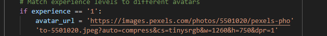

# Testing

Return to [README.md](README.md).

## Code Validation

### HTML

I have used the recommended [HTML W3C Validator](https://validator.w3.org) to validate all of my HTML files. All screenshots for evidence of validation can be found [here](documentation/validation-screenshots.pdf).

| Page | URL | Notes |
| ---- | ---- | ---- |
| Welcome | [W3C](https://validator.w3.org/nu/?doc=https%3A%2F%2Fbirdcount-cff31e785337.herokuapp.com%2F) | ✅ No errors. Page link used|
| About | [W3C](https://validator.w3.org/nu/?showsource=yes&doc=https%3A%2F%2Fbirdcount-cff31e785337.herokuapp.com%2Fabout%2F) | ✅ No errors. Page link used |
| Community Observations | [W3C](https://validator.w3.org/nu/?showsource=yes&doc=https%3A%2F%2Fbirdcount-cff31e785337.herokuapp.com%2Fget_observations%2F) | ✅ No errors. Page link used |
| My Nest | [W3C](https://validator.w3.org) | ✅ No errors. Text input used |
| Admin Nest | [W3C](https://validator.w3.org) | ✅ No errors. Text input used |
| Add Observation | [W3C](https://validator.w3.org) | ✅ No errors. Text input used |
| Edit Observation | [W3C](https://validator.w3.org) | ✅ No errors. Text input used |
| Register | [W3C](https://validator.w3.org/nu/?showsource=yes&doc=https%3A%2F%2Fbirdcount-cff31e785337.herokuapp.com%2Fregister%2F#l111c18) | ✅ No errors. Page link used |
| Log in | [W3C](https://validator.w3.org/nu/?showsource=yes&doc=https%3A%2F%2Fbirdcount-cff31e785337.herokuapp.com%2Flogin%2F#l111c18) | ✅ No errors. Page link used |
| 404 | [W3C](https://validator.w3.org) | ✅ No errors. Text input used |
| 505 | [W3C](https://validator.w3.org) | ✅ No errors. Text input used |

### CSS

I have used the recommended [CSS Jigsaw Validator](https://jigsaw.w3.org/css-validator) to validate my CSS code.

| File | URL | Notes |
| --- | --- | --- |
| style.css | [Jigsaw](https://jigsaw.w3.org/css-validator/validator?uri=https%3A%2F%2Fbirdcount-cff31e785337.herokuapp.com%2F&profile=css3svg&usermedium=all&warning=1&vextwarning=&lang=en) | ✅ Pass. Only errors are from materializa and font awesome |

### JavaScript

I have used the recommended [JShint Validator](https://jshint.com) to validate my JS file.

| File | Notes |
| --- | --- |
| script.js | ✅ Pass. No errors |

### Python

I have used the recommended [PEP8 CI Python Linter](https://pep8ci.herokuapp.com) to validate all of my Python files.

| File | Notes |
| --- | --- |
| app.py |  ✅ Pass. No errors |

## Browser Compatibility

I've tested my deployed project on multiple browsers to check for compatibility issues. I followed each point in the 'Defensive Programming' section below. Evidence of checks in each browser can be seen [here](documentation/browser-compatibility.pdf).

| Browser | Notes |
| ---- | ---- |
| Chrome | ✅ Pass |
| Firefox | ✅ Pass. Fonts appear different in buttons. All other functionality works. |
| Edge | ✅ Pass |
| Brave | ✅ Pass |
| Safari |  Known materialized bug in safari stops user from being able to select from a dropdown. I added a select.js file which has resolved the issue. However, the user now seems to have difficulty logging out. They have to try 3-4 times before it is successful.  |

## Responsiveness

I've tested my deployed project on multiple devices to check for responsiveness issues. I used [website planet](https://www.websiteplanet.com/webtools/responsive-checker/) to check responsiveness on the following screens. I couldn't test pages that needed the user to be logged in with this site, so did the rest of the testing with Chrome DevTools. 

| Device | Size | Evidnece | Notes |
| ---- | ---- | ---- |  ---- |
| Galaxy S10/S9/S8 | 360 x 740 | [Video of both phone screen sizes](documentation/testing/mobile.mp4) | ✅ Pass |
| iPhone 14 /13 /13 pro | 390 x 844 | See above link | ✅ Pass |
| Galaxy Tab S7 plus | 839 x 1194 | [Video of both tablet screen sizes](documentation/testing/tablets.mp4) | ✅ Pass |
| iPad 6 / Mini 5 | 768 x 1025 | See above link | ✅ Pass |
| Laptop | 1366 x 768 | [Video of laptop screen](documentation/testing/laptop.mp4) | ✅ Pass |
| Desktop | 1600 x 900 | [Video of desktop screen](documentation/testing/desktop.mp4) | ✅ Pass |

## Lighthouse Audit

I've tested my deployed project using the Lighthouse Audit tool to check for any major issues.

| Page | Size | Screenshot | Notes |
| ---- | ---- | ---- | ---- |
| Welcome | Mobile |   |  |
| Welcome | Desktop |  |  |
| About | Mobile |  |  |
| About | Desktop |  |  |
| Community Observations | Mobile |  |  |
| Community Observations | Desktop |  |  |
| My Nest | Mobile |  |  |
| My Nest | Desktop |  |  |
| Admin Nest | Mobile |  |  |
| Admin Nest | Desktop |  |  |
| Add Observation | Mobile |  | Poor accessibility due to 'certainty field' label not working correctly with materialize component. |
| Add Observation | Desktop |  | Poor accessibility due to 'certainty field' label not working correctly with materialize component. |
| Edit Observation | Mobile |  | Poor accessibility due to 'certainty field' label not working correctly with materialize component. |
| Edit Observation | Desktop |  | Poor accessibility due to 'certainty field' label not working correctly with materialize component. |
| Register | Mobile |  | Poor accessibility due to 'certainty field' label not working correctly with materialize component. |
| Register | Desktop |  | Poor accessibility due to 'certainty field' label not working correctly with materialize component. |
| Log in | Mobile |  |  |
| Log in | Desktop |  |  |

Performance is generally low due to a large background image. This is something I will consider in the future. It is particularly low on mobiles so I think a plain background will be prefered in future projects.
The accessibility is quite poor in pages with tables. This is due to table headings not being labels. I added labels to improve the accessibility but found that it negatively affected UX. In the future I will consider if a table is the best choice for data which I know won't have a table heading. On this occassion, I didn't realise this issue intil validation and testing and don't have time to recreate the table at this point. Lessons have been learnt for the future. 

## Defensive Programming

Defensive programming was manually tested with the below user acceptance testing:

| Page | User Action | Expected Result | Pass/Fail | Comments |
| ---- | ---- | ---- | ---- | ---- |
| Navbar |  |  |  |  |
|  | Click on Logo | Redirection to Welcome page. | ✅ Pass |  |
|  | Click on 'About' link | Redirection to About page. | ✅ Pass |  |
|  | Click on 'Community Observations' | Redirect to Community Observations page. | ✅ Pass |  |
|  | Click on dropdown menu | Opens dropdown menu to display navigation links. | ✅ Pass |  |
|  | Click on 'Burger menu' | Side menu opens displaying navigation links. | ✅ Pass |  |
|  | Click on 'Admin Nest' | Redirects to Admin Nest page. | ✅ Pass |  |
|  | Click on 'My Nest' | Redirects to My Nest page. | ✅ Pass |  |
|  | Click on 'Logout' | User is removed from session.  | ✅ Pass |  |
|  | Click on 'Logout' | Redirection to Log In page.  | ✅ Pass |  |
|  | Click on 'Logout' | Flash message informs user log out was successful. | ✅ Pass |  |
|  | Click on 'Logout' | 'About', 'Community Observations', 'Sign up', 'Log in' are the only navigation links visible. | ✅ Pass |  |
|  | Click on 'Logout' | 'Add observation' button changes to 'Sign up' button. | ✅ Pass |  |
|  | Successfully logs in | Navbar shows links to About, Community Observations, My Nest and Logout. | ✅ Pass |  |
|  | Successfully logs in as 'admin' | Navbar shows links to About, Community Observations, Admin Nest and Logout. | ✅ Pass |  |
|  | Hovers over logo | Logo expands and cursor changes to pointer. | ✅ Pass |  |
|  | Hovers over 'About' | Container changes colour to highlight link. | ✅ Pass |  |
|  | Hovers over 'Community Observations' | Container changes colour to highlight link. | ✅ Pass |  |
|  | Hovers over dropdown | Container changes colour to highlight link. | ✅ Pass |  |
| Footer |  |  |  |  |
|  | Click on Logo | Redirection to Welcome page. | ✅ Pass |  |
|  | Hovers over logo | Logo expands and cursor changes to pointer. | ✅ Pass |  |
|  | Clicks on 'Learn about the BTO' | Redirects to website for BTO; opens in new tab. | ✅ Pass |  |
|  | Clicks on 'Identify a bird' | Redirects to website for Bird Spot; opens in new tab. | ✅ Pass |  |
|  | Clicks on 'Learn more about Bird Count' | Redirects to website for Bird Count GitHub repository; opens in new tab. | ✅ Pass |  |
|  | Clicks on 'sign-up' button | Redirection to 'Sign up' page. | ✅ Pass |  |
|  | Clicks on 'Add Observation' button | Redirection to 'Add Observation' page. | ✅ Pass |  |
|  | Successfully logs in as 'admin' | Sign-up buttons disappear. | ✅ Pass |  |
|  | User logs in successfully | Redirection to either 'Admin Nest' or 'My Nest' depending on user. | ✅ Pass |  |
|  | User logs in successfully | Sign-up buttons change to 'Add Observation' buttons | ✅ Pass |  |
| Sign Up |  |  |  |  |
|  | Enter valid User Name | Field will only accept alphanumeric username, with 5-20 characters and no spaces. | ✅ Pass |  |
|  | Enter valid Password | Field will only accept alphanumeric Password format, with 5-15 characters. | ✅ Pass |  |
|  | Enter valid email | Field will only accept email format inputs. | ✅ Pass |  |
|  | Click experience field | Options drop down are dispalyed. | ✅ Pass |  |
|  | Click on an experience. | The input field is filled with the selected experience level. | ✅ Pass |  |
|  | Inputs invalid information in any field | Icon flashed red and tooltip explains that the entry is invalid. | ✅ Pass | Experience level cannot be validated but if it is empty on form submission, a flash message appears explaining that it is invalid. |
|  | Click on 'Register' button | Redirection to 'My Nest'. | ✅ Pass |  |
|  | Click on 'Log in' | Redirection to 'Log in' page. | ✅ Pass |  |
| Log In |  |  |  |  |
|  | Enter valid User Name | Field will only accept alphanumeric username, with 5-20 characters and no spaces. | ✅ Pass |  |
|  | Enter valid Password | Field will only accept alphanumeric Password format, with 5-15 characters. | ✅ Pass |  |
|  | Click Log In button with valid Username & Password | Redirection to 'My Nest'. Flash message informs user that log in was successful. | ✅ Pass |  |
|  | Click Log In button with empty Password field | Prompts for Password. | ✅ Pass |  |
|  | Click Log In button with empty Username field | Prompts for Username. | ✅ Pass |  |
|  | Click Log In button with both input fields empty | Prompts for input. | ✅ Pass |  |
|  | Click 'Register Account' | Redirection to 'Sign in' page. | ✅ Pass |  |
| About |  |  |  |  |
|  | Click 'Learn about the BTO' button | Redirects user to BTO website in new tab. | ✅ Pass |  |
|  | Click 'Sign-up' button | Redirection to sign up page. | ✅ Pass |  |
|  | Click 'Add Observation' button | Redirection to add observation page. | ✅ Pass |  |
|  | Click 'Identify a bird' button | Redirection to Bird Spot website in new tab. | ✅ Pass |  |
| Community Observations |  |  |  |  |
|  | Click 'Log in' button | Redirection to 'Log in' page. | ✅ Pass |  |
|  | Click 'Add Observation' button | Redirection to 'Add Observation' page. | ✅ Pass |  |
|  | Enters invalid enquiry in search field | Search field flashes red. It allows a minimum of 3 letters. | ✅ Pass |  |
|  | Search query with no results | Message explaining that there were no results for that search. | ✅ Pass |  |
|  | Clicks 'Reset All' button | All observations are displayed. | ✅ Pass |  |
|  | Clicks a 'sort' icon next to a table heading. | Observations are sorted by this field in the direction indicated by the tooltip. | ✅ Pass |  |
|  | Clicks a 'sort' icon next to a table heading. | Icon changes to indicate the sort direction if clicked again. | ✅ Pass |  |
|  | Clicks 'Reset All' button | All observations are displayed with the most recent first. | ✅ Pass |  |
|  | Clicks on an observation | Observation modal appears with extra information than is displayed in the table. | ✅ Pass |  |
|  | Hovers over observation | Row is highlighted and expand icon appears and pulses. | ✅ Pass |  |
|  | Clicks on 'Edit' button | Redirects to the 'Edit Observation' page which has fields prefilled with data from that observation. | ✅ Pass |  |
|  | Clicks on 'Delete' button | Delete confirmation modal appears. It contains information about the observation being deleted. | ✅ Pass |  |
|  | Clicks 'Yes, delete' in modal for delete confirmation | Modal closes, observation disappears from table and a flash message appears confirming this action was successful. | ✅ Pass |  |
| My Nest |  |  |  |  |
| (BIRD STATS SECTION) | Click 'View Your Life List' button | Modal opens displaying list of bird species observed with the quantities. If the list is empty a button to 'Add Observation' appears. | ✅ Pass |  |
|  | Clicks 'Add Observation' button in life list modal. | Redirection to Add Observation page. | ✅ Pass |  |
| (MY OBSERVATIONS SECTION) | Clicks 'Add Observation' button in life list modal. | Redirection to Add Observation page. | ✅ Pass |  |
|  | Clicks on an observation | Observation modal appears with extra information than is displayed in the table. | ✅ Pass |  |
|  | Hovers over observation | Row is highlighted and expand icon appears and pulses. | ✅ Pass |  |
|  | Clicks on 'Edit' button | Redirects to the 'Edit Observation' page which has fields prefilled with data from that observation. | ✅ Pass |  |
|  | Clicks on 'Delete' button | Delete confirmation modal appears. It contains information about the observation being deleted. | ✅ Pass |  |
|  | Clicks 'Yes, delete' in modal for delete confirmation | Modal closes, observation disappears from table and a flash message appears confirming this action was successful. | ✅ Pass |  |
| (CONTACT ADMIN SECTION) | Click 'Pigeon Hole' button | Messages from the admin appear. | ✅ Pass |  |
|  | Click on expandable message | Message content appears. | ✅ Pass |  |
|  | Clicks 'reply' button | Modal opens to reply to the message. All fields are prefilled with the exception of the message body. | ✅ Pass |  |
|  | Clicks 'send' | Modals close and flash message appears confirming the message has been sent. | ✅ Pass |  |
|  | Clicks 'delete' message | Confirmation modal appears containing details about the message. | ✅ Pass |  |
|  | Clicks 'Confirm delete' button | Modals close. A flash message appears confirming that the message was deleted. | ✅ Pass |  |
|  | Clicks 'Contact Admin' | Modal appears with subject and message fields. | ✅ Pass |  |
|  | Clicks 'Send Message' with empty subject field | Prompted to fill out subject field. | ✅ Pass |  |
|  | Clicks 'Send Message' with empty message field | Prompted to fill out message field. | ✅ Pass |  |
|  | Clicks 'Send Message' with both fields filled. | Modal closes. Flash message confirms the message has been sent. | ✅ Pass |  |
| (MY ACCOUNT SECTION) | Clicks visibility switch | Switch changes side. Visibility is changed to either visible or invisible (where-ever switch suggests). If invisible, the observations from this user are hidden in the community observations page. Flash message confirms change. | ✅ Pass |  |
|  | Clicks anonymity switch | Switch changes side. Anonymity is changed to either anonymous or named (where-ever switch suggests). If anonymous, the observations from this user are shown to be seen by 'anonymousbirdy' in community observations. Flash message confirms change. | ✅ Pass |  |
|  | Clicks 'Edit' button for email address | Edit email address modal opens. | ✅ Pass |  |
|  | Enters invalid email address. | Modal closes with no changes. | ✅ Pass |  |
|  | Enters valid email address and clicks 'submit' | Modal closes. Email appears updated. Flash message confirms change. | ✅ Pass |  |
|  | Clicks 'Edit' button for experience | Edit experience modal opens. | ✅ Pass |  |
|  | Clicks dropdown selection | Options appear | ✅ Pass |  |
|  | Clicks an option | Input field in filled with selected observation. | ✅ Pass |  |
|  | Clicks 'update' button | Modal closes. Flash message confirms deletion. Experience level appears changed. User avatar changes to match experience level. | ✅ Pass |  |
|  | Clicks 'Delete Account' button | Confirmation modal appears with information about what happens to their data when they delete their account. | ✅ Pass |  |
|  | Clicks 'confirm delete' button | Redirection to welcome page. Flash message confirms deletion. | ✅ Pass |  |
| Admin Page |  |  |  |  |
|  | Click 'Pigeon Hole' button | Messages from the admin appear. | ✅ Pass |  |
|  | Click on expandable message | Message content appears. | ✅ Pass |  |
|  | Clicks 'reply' button | Modal opens to reply to the message. All fields are prefilled with the exception of the message body. | ✅ Pass |  |
|  | Clicks 'send' | Modals close and flash message appears confirming the message has been sent. | ✅ Pass |  |
|  | Clicks 'delete' message | Confirmation modal appears containing details about the message. | ✅ Pass |  |
|  | Clicks 'Confirm delete' button | Modals close. A flash message appears confirming that the message was deleted. | ✅ Pass |  |
|  | Click 'Delete' button | A modal appears with details of the user in the row of the delete button. This asks for confirmation of deletion. | ✅ Pass |  |
|  | Clicks 'confirm' | User is deleted and a flash message appears with confirmation. | ✅ Pass |  |
| Add Observation Page |  |  |  |  |
|  | Enters text in 'Bird Species' input field | Autocomplete options appear containing bird species and letters entered by user. | ✅ Pass |  |
|  | Clicks on an autocomplete option | Selected option populated input field | ✅ Pass |  |
|  | Enters text in 'Location' input field | Autocomplete options appear containing districts in the UK and letters entered by user. | ✅ Pass |  |
|  | Clicks on an autocomplete option | Selected option populated input field | ✅ Pass |  |
|  | Clicks on 'date' field | Date picker appears with only the current day and previous available to select. | ✅ Pass |  |
|  | Clicks a date | Date picker closes and selected date populates date field. | ✅ Pass |  |
|  | Clicks on 'time' field | Time picker appears. | ✅ Pass |  |
|  | Selects a time | Selected time populates input field and modal closes. | ✅ Pass |  |
|  | Clicks somewhere along certainty range. | Value of that field pops up and slider moves. | ✅ Pass |  |
|  | Clicks 'choose file' | Local folder opens so user can select a photo. | ✅ Pass |  |
|  | Selects a photo | Name of file appears next to 'choose file' button. | ✅ Pass |  |
|  | Click 'Submit Observation' with any required field empty | 'Please fill out this field' tooltip appears. | ✅ Pass |  |
|  | Clicks 'Submit Observation' with valid fields | Observation is submitted. Flash message appears with confirmation. User is directed their nest. | ✅ Pass |  |
|  | Click 'Cancel, return to my nest' button | Redirected to their nest. | ✅ Pass |  |
|  | Click 'Cancel, return to observations' | Redirected to community observations. | ✅ Pass |  |
| Edit Observation Page | *(Mostly the same as above)* |  |  |  |
|  | Enters text in 'Bird Species' input field | Autocomplete options appear containing bird species and letters entered by user. | ✅ Pass |  |
|  | Clicks on an autocomplete option | Selected option populated input field | ✅ Pass |  |
|  | Enters text in 'Location' input field | Autocomplete options appear containing districts in the UK and letters entered by user. | ✅ Pass |  |
|  | Clicks on an autocomplete option | Selected option populated input field | ✅ Pass |  |
|  | Clicks on 'date' field | Date picker appears with only the current day and previous available to select. | ✅ Pass |  |
|  | Clicks a date | Date picker closes and selected date populates date field. | ✅ Pass |  |
|  | Clicks on 'time' field | Time picker appears. | ✅ Pass |  |
|  | Selects a time | Selected time populates input field and modal closes. | ✅ Pass |  |
|  | Clicks somewhere along certainty range. | Value of that field pops up and slider moves. | ✅ Pass |  |
|  | Clicks 'current image' button | Modal containing the current image for this observation appears. | ✅ Pass |  |
|  | Clicks 'choose file' | Local folder opens so user can select a photo. | ✅ Pass |  |
|  | Selects a photo | Name of file appears next to 'choose file' button. | ✅ Pass |  |
|  | Click 'Submit Observation' with any required field empty | 'Please fill out this field' tooltip appears. | ✅ Pass |  |
|  | Clicks 'Submit Observation' with valid fields | Observation is submitted. Flash message appears with confirmation. User is directed to 'Community Observations'. | ✅ Pass |  |
|  | Click 'Cancel, return to my nest' button | Redirected to their nest. | ✅ Pass |  |
|  | Click 'Cancel, return to observations' | Redirected to community observations. | ✅ Pass |  |

## User Story Testing

| User Story | Pass/Fail | Comments |
| ---- | ---- | ---- |
| As a first time user, I would like to be able to easily navigate the site, so that I can find what I'm looking for intuitively.  | ✅ Pass | The navbar provides clear navigation options. |
| As a first time user, I would like to understand the purpose, benefits and functionality of the site, so I can decide if it fits my needs.   | ✅ Pass | 'Welcome' page, 'About' page and 'Community Observations' page all give the user the chance to understand the site. |
| As a first time user, I would like to see buttons and links to login/register, so that I can sign up easily.  | ✅ Pass | Sign-up links are places on every page and the footer for ease. |
| As a first time user, I would like to see what current users have been doing on the site, so I can see how the site can be used.  | ✅ Pass | The 'Community Observations' shows data added by current users. This is a good example of how the site can be used. |
| As a first time user, I would like to see links and buttons to add observations with clear instruction, so that I can record by bird sightings.  | ✅ Pass | Add observations buttons are located throughout the site for convenience and direct user to 'Add observation' page which has tooltips to help the user understand what to do. |
| As a first time user, I would like a responsive design, so that I can view and add observations on any device. | ✅ Pass | The site has been tested on different screen sizes and in different browsers and is responsive and compatible with all. |
| As a returning user, I would like to be able to see my own observations separately, so I don't have to look through irrelevant data. | ✅ Pass | 'My Nest' displays the users previous observations. |
| As a returning user, I would like an option to hide my username from the community, so that I can add observations  without being identified. | ✅ Pass | In 'My Nest' the user has the option to change account settings and to make their observations anonymous. |
| As a returning user, I would like an option to hide my observations from the community, so that I can keep my observations to myself if my certainty is low. | ✅ Pass | In 'My Nest' the user has the option to change account settings and to make their observations invisible. |
| As a returning user, I would like to contact the admin, so I can report any issues with the site or ask questions.   | ✅ Pass | In 'My Nest' the user has the option to send a message to the admin and to check their messages. |
| As a returning user, I would like to search through the community observations, so I can find data that is relevant for me.  | ✅ Pass | The 'Community Observations' page has a search feature which allows the user to search the 'bird species' and 'location' fields. |
| As a returning user, I would like to easily log in, so that I can access my records and data. | ✅ Pass | There is a link to log in in the navigation. The login process is simple and quick. |
| As a returning user, I would like to be able to see some stats from my observations, so that I can set some personal bird watching goals.  | ✅ Pass | In 'My Nest' the bird stats for the user are displayed. This includes number of species, total number of birds, average certainty and their 'Life List'. |
| As a returning user, I would like to easily add, edit or delete observations, so that I can make sure my records are accurate.  | ✅ Pass | The user can add, edit or delete their observations from their nest or the 'Community Observations' page. The buttons to carry out any of these actions are clear. |
| As the site admin, I would like to see a list of registered users, so I have information about how the site is used.  | ✅ Pass | The 'Admin Nest' contains a list of users with the option to delete them. |
| As the site admin, I would like to be able to remove users, so that I can manage site activity and behaviour.  | ✅ Pass | The 'Admin Nest' contains a list of users with the option to delete them. |
| As the site admin, I would like to delete and edit observations, so that I can improve the experience of site users. | ✅ Pass | The admin can edit or delete any observations in the  'Community Observations' page. The buttons to carry out any of these actions are clear. |
| As the site admin, I would like to be able to see and write messages, so that I can reply to queries from users. | ✅ Pass | in 'Admin Nest' the admin is able to access their pigeon hole which contains messages from users. |

 
## Bugs

### Resolved Bugs

- #### Delete observation: random deletion
	When user selects an observation to delete, the details of a different observation appear in the observation modal. This was due to the observation ID not being passed to the modal so the observation at the top of the list was deleted instead. This was simple to resolve by carrying the correct id into the modal.

	

	
Evidence

	- Bug

		
		[Video of bug](documentation/bugs/admin_delete_bug.mp4)

	- Code to fix

		

	

	

- #### Edited observations: don't appear in community observations
	When editing an observation the changes the user made would be implemented and in MongoDB, these could be seen. However, the observation disappeared from the observations table. I found that this bug was caused because I hadn't added the visible and anonymous fields to the 'edit observation' function. This meant the fields were emptied whenever the user edited an observation and due to the flask if statement that only shows 'visible' observations, the edited observations (which now have empty 'visible' fields) were not displayed. 
	After adding this code, the big was fixed and editing observations didn't affect observation visibility.

- #### Privacy settings: unexpected changes to data.
	Privacy settings for visibility and anonymity values were not changing to the value they were set to. The behaviour of the switches and data was not as expected and I found through the use of print statements, that this was due to the data type being a string of 'True' and 'False' and not Bools True and False. I used a method to convert the data to Boolean data before updating the observation in the database. This resolved the issue and the feature worked as expected afterwards. 

- #### Privacy settings: only one observation updated.
	When changing either of the privacy settings, the changes were evident in one observation but not all. For example, if changing to anonymous, only one observation by that user would be displayed as anonymous. I found that this was because I used to the update_one() method instead of the update_many() method. After changing this, I found that all observations changed as expected. 

	

	
Evidence

	- Bug

	
	
	These screenshots show two observations by the same user. They show that when anonymous, only one of the obervations by that user is changed to 'anonymousBirdy'. The username is cropped out of some screenshots, I hope this clarifies.  
	
	
	

	- Code to fix

	
	

	

- #### Life List: doesn't display correct quantities after observation is edited
	When checking the functionality of the life list, and also the bird stats, the numbers were sometimes incorrect. I discovered that this was only the case if an observation in the nest had been edited so I investigated the edit function in more detail. I found that the observation 'quantity' field was a string and not an integer. I added a method to convert quantity data to an integer and this resolved the issue. Stats were displaying as expected. 

	

	
Evidence

	- Bug
		
		
		

	- Code to fix

		[Video showing fix](documentation/bugs/bug-delete-user-delete-observation.mp4)

	

- #### Bird Stats: dividing by '0' error
	When a user with no observation accesses their nest, an error appears indicating that 0 cannot be divided. I discovered that this was relating to the 'certainty' statistic so adjusted the junction to add a try and catch error handler. This didn't affect the display on the users end but prevented the error message from appearing and replaced it with an explanation. 

	

	
Evidence

	- Code to fix

		

	

	
- #### Edit Account Details: experience level not displayed bug
	I found that the experience level of the user was not displaying in the 'Edit Account Details' section of 'My Nest'. I found that this was caused because the experience level selector couldn't be set as a required field (as a value is always selected). Therefore, if a new user left the field empty or an existing user changed it to empty, no experience level would display. To resolve this I added an 'if' statement  in the register and edit experience functions to make sure the user chose an experience level.
	

- #### Delete Account: deleted users' observations can be claimed by new account with that username
	When a user's account was deleted and a new user chooses that same username, the observations with a 'seen_by' field that matches the username are displayed as if they were created by this new user. I discovered this when creating a new account for a username I just deleted and found the nest was full of observations. 
	To fix this bug I changed the 'seen_by' field of all observations by the deleted user to 'admin' as that account is deleted. I also added a 'seen_by_id' which is set on creation of the observation and this doesn't change. The seen_by_id remains the same so it can be traced back to the original user and grouped with other observations by that user. 

	

	
Evidence

		[Video showing fix](documentation/bugs/bug-delete-user-delete-observation.mp4)

	

- #### JS Error
	On any page other than 'My Nest' I as getting an error in the console saying that it 'couldn't read add event listener null'. I found that this was being caused because the JavaScript file and the event listener were running on every page, but the event listener was applied to elements that were only on 'My_Nest'. Hence, when on any other page, the element didn't exist according in JS, so an error was thrown. 
	To resolve this I added a conditional so the JavaScript function only applied to the nest page and the correct form.

	

	
Evidence

	- Bug
		
		
		

	- Code to fix

		
		

	

- #### Navbar: side-nav overlay covering side-nav
	When testing the sid-nav functionality I found that the overlay had started covering the actual menu so nothing in the menu could be selected. This hadn't been happening for long so I knew it was an issue with a recent change I had made. Initially I moved the overlay to the side so it didn't cover the menu anymore but later realised this hadn't actually combatted the cause of the bug. I realised this when facing the following bug 'Input fields covering side-nav'; see this bug for the fix for the current bug. 

	

	
Evidence

	- Bug
		
		

	- Code to fix

		
		

	

- #### Navbar: input fields covering side-nav
	When using the side-nav on a page with input fields, the input fields would be positioned on top of the side-nav menu so nothing could be selected. This turned out to be related to the above bug , 'side-nav overlay covering side-nav'. The cause of this bug was that I had the nav-bar set as 'position: fixed' which meant that certain elements appeared above the side nav. I changed the position of the navbar to 'relative' and this resolved this bug and also more effectively resolved the bug above.

	

	
Evidence

	- Bug

		
		
		

	- Code to fix

		
		

	

- #### Messaging: collapsible messages and reply modal
	When using the reply to message functionality I found that the underlying collapsible elements were being expanded in closed when clicking on the reply modal. This made use of the reply modal almost impossible as the elements in the reply modal weren't easy to find. To clarify, the interaction of the collapsible elements was on top of the input fields in the reply modal, which made it difficult to use the input fields. 
	I found that this was being caused because the reply modal was inside the collapsible content and therefore every time it was clicked, the content would expand or close. I moved the modal outside of the collapsible content and the bug was resolved. 
	After resolving this I found that there were issues with validation. I decided to remove the collapsible component from materialise and display the message with the summry. 

	

	
Evidence

	- Bug

		[Video of bug](documentation/bugs/reply-modal-bug.mp4)

	- Code to fix

		[Video of fix](documentation/bugs/reply-modal-fix.mp4)

	

 - #### Form Modals: close button submits the form
	When using modal with input fields, if the user decided to cancel the changes they were making and close the modal, they could click the 'close' button in the modal. This, however, would display a flash message confirming the changes and the changes could be seen in the database. I found that this was because the close button was inside the form element. To fix this, I removed the close buttons so the user just has to click off the modal to close it. I realise that I could have moved the button to the modal footer, outside the form, but found that this method looked sleeker and was still intuitive for UX.

	

	
Evidence

	- Bug

		[Video of bug](documentation/bugs/close-modal-submit-bug.mp4)

	- Code to fix

		[Video of fix](documentation/bugs/close-modal-submit-fix.mp4)

	

- #### Community Observations: modals not opening as expected
	When clicking on an observation in the community observations, the bird details appear in a modal as expected. However, when clicking the 'delete' button on an observation, the same modal opens over the top of the delete modal. This is not as intended and makes it very difficult for the user to use the table functionality.
	I fixed this bug iitially, as shown in the screenshots but had validation errors so I used a different method. See screenshots below. 

	

	
Evidence

	- Bug

		
		[Video of bug](documentation/bugs/table_link_bug.mp4)

	- Code to fix (first attempt)

		Initially I solved the bug as described here but found that I couldn't have a 'href' in a 'td' so I made some major changes.
		
	
	- New Bug 

		You can see here that the delete button opens the modal for both the observation and delete confirmation.
		[Video of bug](documentation/bugs/observation-modals-bug.mp4)
	
	- Final fix code

		
		
		

		You can see in the above code that I have created a javascript event listener that detects if anything with class 'details-modal' is clicked. I added this class to relevant table data. The function called by the event listener sets variables based on the observation data passed into the function. You can see the dataset attributes in the html. These variables were then used to fill the modal with information about that specific observation. 
		I found that because of the time it took for the image to be fetched, I had to add an 'onload' method to stop the modal from opening before the image had been changed; sometimes the previous observations image was still visible when the modal openned. I found that the modal now works as hoped and other elements in the table are not affected. 

	

- #### Avatar: not appearing when experience level is changed
	When validating my python code for PEP8 complience, I had to shorten the links to the images for the avatar. I did this by wrapping '' around two halves of the link. I hadn't realised that this stopped the link from working and the avatar stopped appearing when changing experience level. When I realised this was the cause I tried wrapping the two strings in brackets and concating them with the '+' sign. 

	

	
Evidence

	- Bug

		
		
		

	- Code to fix

		
		
		

	

### Unresolves bugs

- #### Page redirection:  edit observation and new observation pages redirect to previous
	I found that after editing an observation as an admin, they were redirected to 'My Nest' rather than 'Admin Nest'. I don't want the admin to be able to get to this page so I tried to redirect the user to the previous page. This didn't work because of the form submission causing the page to refresh. As I don't want the admin getting to the 'My nest' page, and I can't detect where the user has accessed this page from ('community observations' or 'My Nest'), I decided to set the redirect to 'Community Observations' as all users have access to this page. I informed the user with a tooltip and also added cancel buttons that let the user decide where to be redirected when they cancel. The button to 'My Nest' is hidden if the user is the admin. 
	This isn't an ideal solution but is at least transparent and clear to the user. I will continue looking for solutions to  redirect to previous page from a page with a form as I think this disrupts UX.

- #### Community Observations: search and sort by username shows anonymous users in position of their actual username
	When a user is set to anonymous, their username isn't displayed in the community observations, as intended. When a user sorts by  usernames or searches an anonymous user's name, their observations will be displayed (still as anonymous). This is a give away of the identity of the user so makes the anonymity feature less effective. 
	I couldn't find solution to this in the time I had so decided to remove the option to sort and search by username as this isn't an essential functionality. I think having this implemented and not working properly is more impactful on UX than to remove the functionality and continue looking for solutions.

- #### Sorting by date

	Just before submission I found a bug in the community observations table. This is related to the sort functionality. When sorting by date, it sorts based on day of the month, regardless of month and year. This will be a priority, but I unfortunatley won't have time to fix this bug before submission. 

- #### Adding a time to an observation

	It is possible for the user to avoid putting a numeric time in the time field. It is difficult to do this, but is possible. I again discovered this bug before submission so do not have time to fix it. It will be second priority to fix (after the date sort fix above) when I am able to continue work on the project again.

There are no other bugs that I am aware of.

